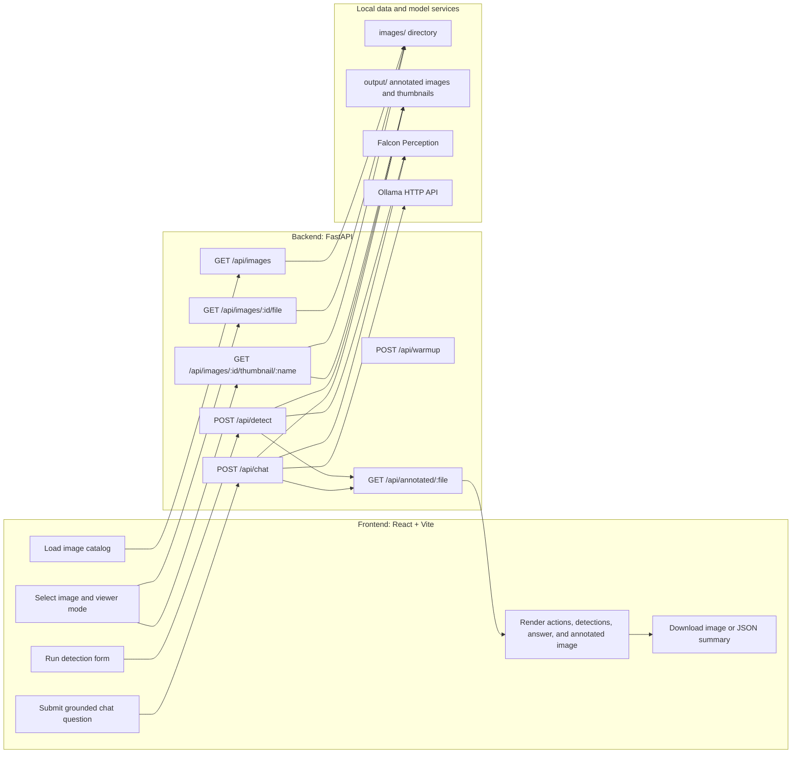
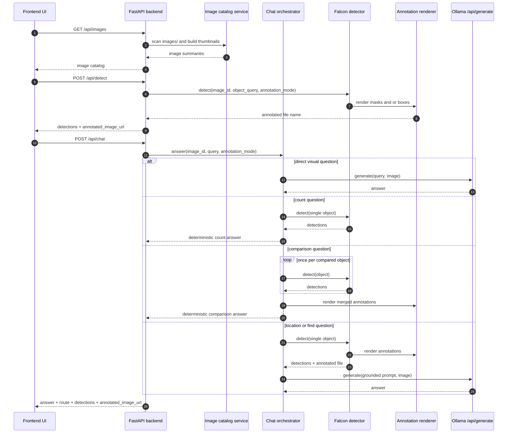
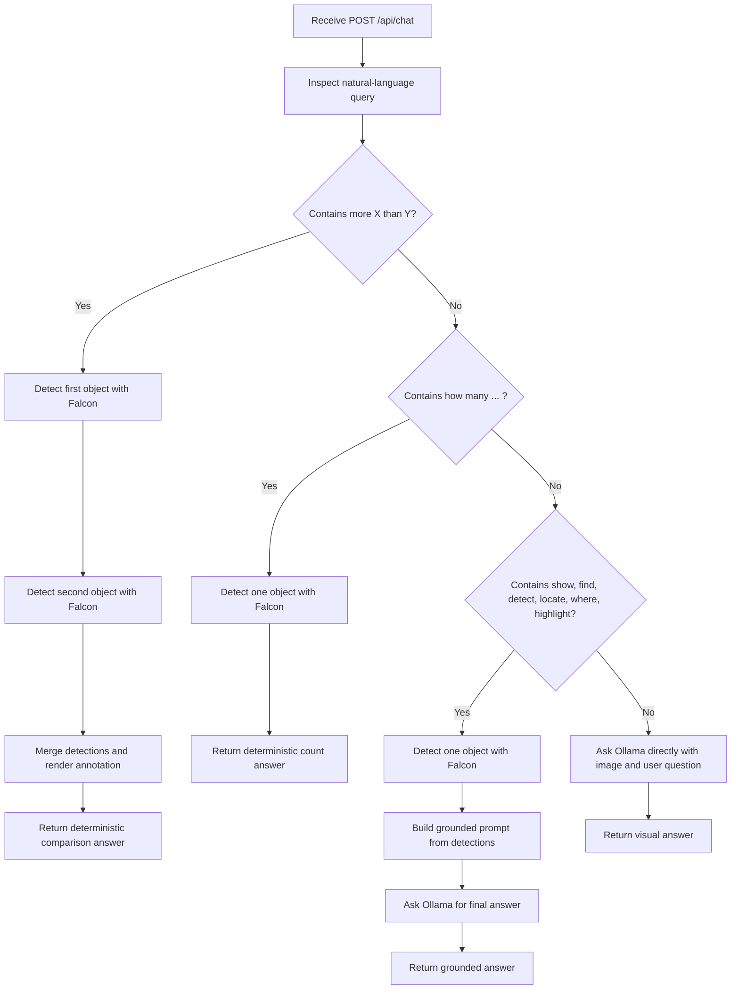

# VisionAI Agentic Workflow

This document describes the current Phase 1-5 application flow: what runs in the frontend, what runs in the backend, the API boundaries, and the bounded action loop inside the backend orchestrator.

## System split

## Current request and response paths

## Current bounded agent loop

The current implementation is a bounded single-request action loop inside the backend. Every plan has an explicit action list and is capped at six actions.

## Frontend responsibilities

- Load the image catalog from `GET /api/images` on startup.
- Let the user select an image and annotation mode.
- Call `POST /api/detect` for explicit object detection requests.
- Call `POST /api/chat` for natural-language questions.
- Display the selected image, the latest annotated image, detections, status messages, errors, and chat history.

## Backend responsibilities

- Restrict image access to the repo `images/` directory.
- Generate and serve thumbnails.
- Normalize Falcon output into a stable API response shape.
- Render annotated PNG files into `output/annotated`.
- Decide whether a chat question should go directly to Ollama or through Falcon first.
- Answer count and count-comparison prompts deterministically after detection.

## Current external calls

- Frontend to backend:
  - `GET /api/images`
  - `GET /api/images/{image_id}/file`
  - `GET /api/images/{image_id}/thumbnail/{thumbnail_name}`
  - `POST /api/detect`
  - `POST /api/chat`
  - `GET /api/annotated/{file_name}`
- Backend to Ollama:
  - `POST {OLLAMA_BASE_URL}/api/generate`
- Backend to Falcon:
  - in-process Python model load and inference through the Falcon Perception package

## Notes on scope

- The implemented loop is Phase 3 routing, not the Phase 4 multi-step replanning agent yet.
- There is no browser-side filesystem access; all image access goes through the backend.
- Falcon and Ollama are still sensitive to local runtime availability, GPU memory, and host dependencies.